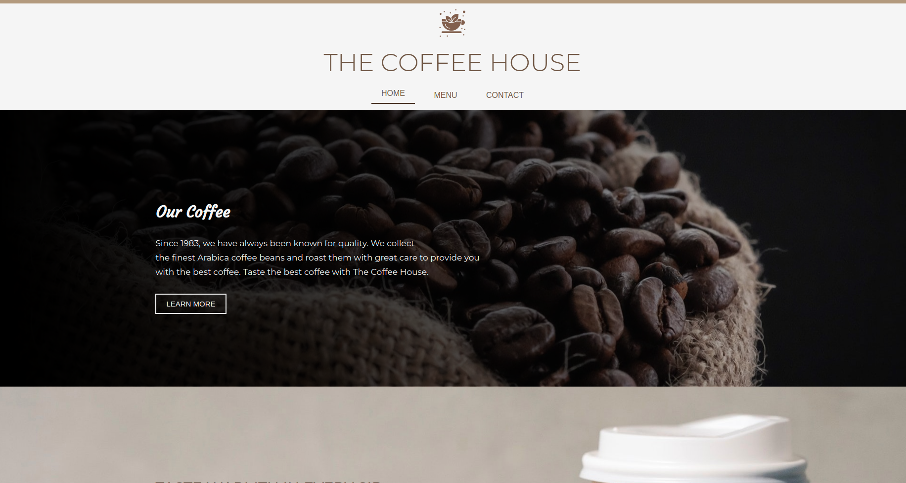
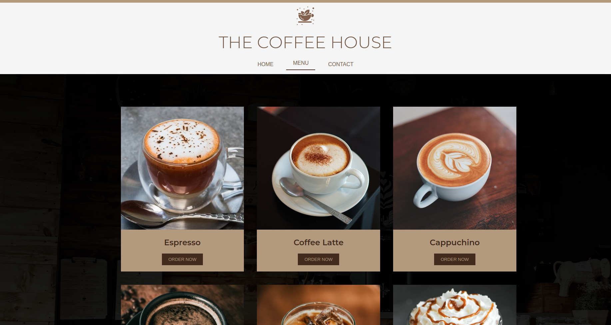
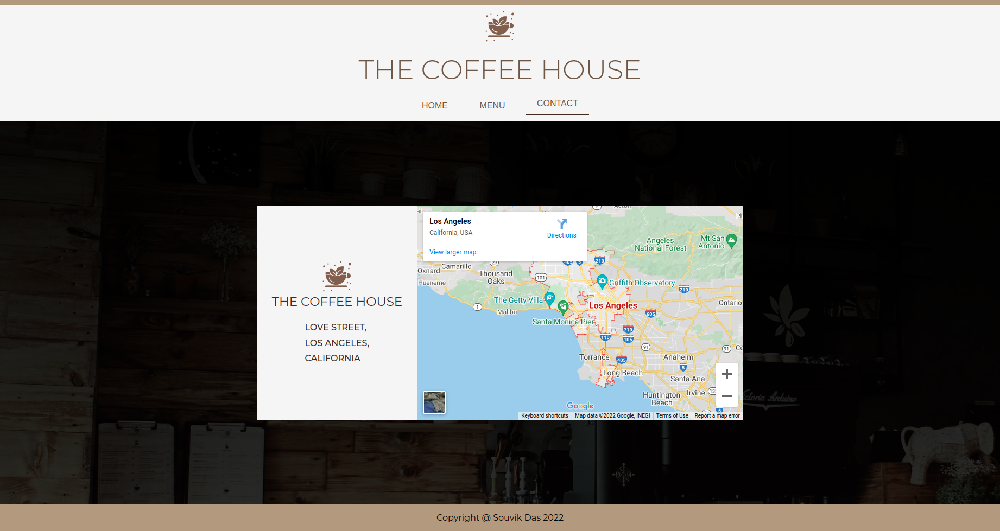

This is an assignment from the [The Odin Project](https://www.theodinproject.com/) to implement webpack.

Visit: [The Coffee House](https://whyucode.github.io/the-coffee-house/)

### Tech Stack

 - HTML5
 - CSS3
 - Javascript
 - Webpack

### Steps to run

To run the application on your local machine - 
 - Clone this repo in your machine.
 - Open the folder and open terminal in the current directory.
 - Run `npm install` in terminal to install the necessary packages
 - Run `npn run build` to create the webpack bundle. You can see `main.js` and a few other image files being created in the `dist` folder.
 - Open the `index.html` in your browser to display the website.

### Screenshots

